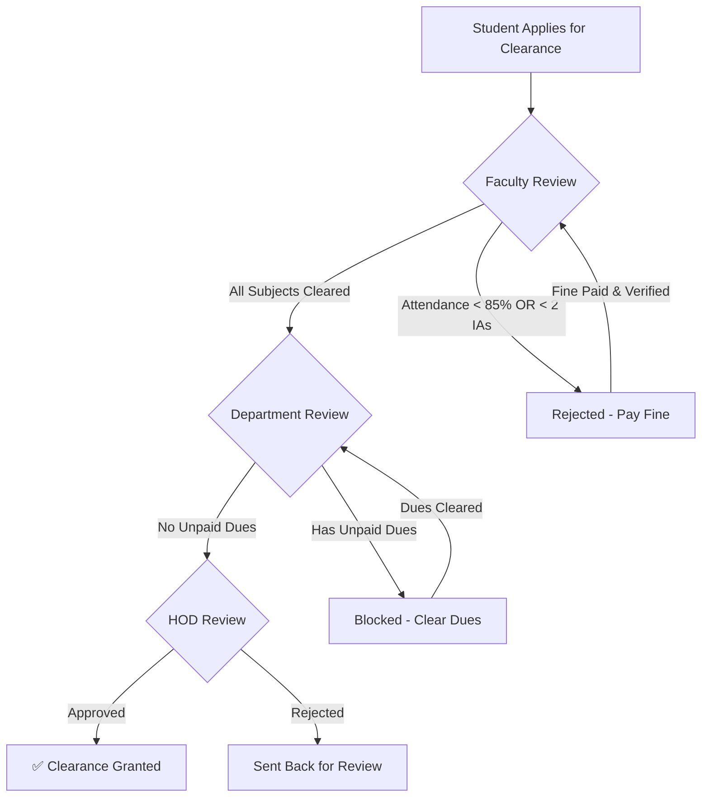
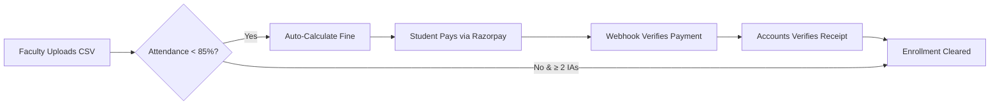

<p align="center">
  
  
  
  
  
  
</p>

<h1 align="center">🎓 NOC Portal — No Objection Certificate Management System</h1>

<p align="center">
  <strong>A multi-tenant SaaS platform for automating academic clearance, attendance compliance, and dues management across educational institutions.</strong>
</p>

<p align="center">
  <a href="#-features">Features</a> •
  <a href="#%EF%B8%8F-architecture">Architecture</a> •
  <a href="#-clearance-workflow">Workflow</a> •
  <a href="#-role-hierarchy">Roles</a> •
  <a href="#-tech-stack">Tech Stack</a> •
  <a href="#-getting-started">Setup</a> •
  <a href="#-security">Security</a>
</p>

---

## 📋 Overview

NOC Portal digitizes the traditional paper-based "No Due Certificate" process used by Indian engineering colleges. Instead of students physically visiting 8+ departments to collect signatures, the entire clearance pipeline — from faculty attendance verification to HOD final approval — happens in a single web application.

**Built for scale:** The platform is multi-tenant, meaning a single deployment serves multiple colleges with complete data isolation.

---

## ✨ Features

### 🎯 Core Features

| Feature | Description |
|---------|-------------|
| **Automated Clearance Pipeline** | Faculty → Department → HOD → Cleared — enforced at database level |
| **Attendance Compliance** | Strict 85% attendance + 2 IA minimum rule with server-side guards |
| **Online Fine Payments** | Razorpay-powered payment gateway for attendance and library fines |
| **Bulk Operations** | CSV upload for students, attendance, dues — up to 500 records per batch |
| **Multi-Tenant SaaS** | One deployment, multiple colleges, complete data isolation |
| **Super Admin Portal** | Platform-level management for onboarding new institutions |

### 📊 Role-Based Dashboards

| Dashboard | Capabilities |
|-----------|-------------|
| **Student** | View clearance status, pay fines, download receipts, track IA attendance |
| **Faculty** | Manage attendance per subject, upload IA data via CSV, approve/reject clearance |
| **Staff** | Department-wide student management, fine overrides, attendance due assignments |
| **Clerk** | First/second year student management, subject enrollment, section management |
| **HOD** | Final clearance approval, teacher assignment monitoring, staff activity logs |
| **Accounts** | College-wide dues management, fee verification, fine category configuration |
| **FYC (First Year Coordinator)** | Cross-department management for Sem 1 & 2 students |
| **Librarian** | Library dues tracking, bulk processing, permit management |
| **Admin** | Full institution control — users, subjects, departments, semesters, assignments |
| **Super Admin** | Platform management — tenant provisioning, error logs, system health |

### 🔔 Additional Features

- 🌙 **Dark/Light Theme** — Per-user theme preference synced to database
- 📱 **Responsive Design** — Works on desktop, tablet, and mobile
- 📄 **PDF Receipt Generation** — Auto-generated payment receipts with jsPDF
- 📊 **Activity Audit Logs** — Every action logged with user, role, timestamp
- ⏰ **Session Management** — Auto-logout after 15 min inactivity with warning
- 🔄 **Real-time Data** — React Query for smart caching and background refetching
- 🔐 **PKCE Auth Flow** — Secure OAuth with Proof Key for Code Exchange

---

## 🏗️ Architecture

### System Architecture

```
┌─────────────────────────────────────────────────────────────────┐
│                        CLIENT (Browser)                         │
│  ┌──────────┐  ┌──────────────┐  ┌──────────┐  ┌────────────┐  │
│  │  React   │  │  React Query │  │  Router   │  │  Razorpay  │  │
│  │  19 SPA  │  │  (Caching)   │  │  (v7)     │  │  Checkout  │  │
│  └────┬─────┘  └──────┬───────┘  └────┬─────┘  └─────┬──────┘  │
│       └───────────────┼──────────────┼─────────────┘          │
└───────────────────────┼──────────────────────────────────────────┘
                        │ HTTPS (JWT + Anon Key)
┌───────────────────────┼──────────────────────────────────────────┐
│                 SUPABASE PLATFORM                                │
│                        │                                         │
│  ┌─────────────────────▼─────────────────────────┐               │
│  │              Supabase Auth (PKCE)             │               │
│  │         JWT Token + Session Management         │               │
│  └─────────────────────┬─────────────────────────┘               │
│                        │                                         │
│  ┌─────────────────────▼─────────────────────────┐               │
│  │            Edge Functions (Deno)               │               │
│  │  ┌──────────────┐  ┌───────────────────────┐  │               │
│  │  │ create-user  │  │ create-razorpay-order │  │               │
│  │  │ bulk-create  │  │ razorpay-webhook      │  │               │
│  │  │ provision-   │  │ log-error             │  │               │
│  │  │ tenant       │  │ admin-api             │  │               │
│  │  └──────────────┘  └───────────────────────┘  │               │
│  └─────────────────────┬─────────────────────────┘               │
│                        │                                         │
│  ┌─────────────────────▼─────────────────────────┐               │
│  │          PostgreSQL + Row Level Security       │               │
│  │  ┌────────────┐  ┌───────────┐  ┌──────────┐  │               │
│  │  │  90+ RLS   │  │  20+ RPCs │  │ Triggers │  │               │
│  │  │  Policies  │  │  (Atomic) │  │ & Guards │  │               │
│  │  └────────────┘  └───────────┘  └──────────┘  │               │
│  │                                                │               │
│  │  Tables: profiles, subjects, subject_enrollment,│               │
│  │  clearance_requests, student_dues, library_dues,│               │
│  │  ia_attendance, payment_orders, activity_logs,  │               │
│  │  tenants, departments, semesters, notifications │               │
│  └────────────────────────────────────────────────┘               │
└──────────────────────────────────────────────────────────────────┘
```

### Multi-Tenant Data Isolation

```
┌─────────────────────────────────────────────────┐
│              Single PostgreSQL DB                │
│                                                  │
│  ┌──────────────┐  ┌──────────────┐              │
│  │  Tenant A     │  │  Tenant B     │             │
│  │  (MIT Mysore) │  │  (XYZ College)│             │
│  │               │  │               │             │
│  │  tenant_id=A  │  │  tenant_id=B  │             │
│  │  ───────────  │  │  ───────────  │             │
│  │  profiles     │  │  profiles     │             │
│  │  subjects     │  │  subjects     │             │
│  │  enrollments  │  │  enrollments  │             │
│  │  dues         │  │  dues         │             │
│  └──────────────┘  └──────────────┘              │
│                                                  │
│  RLS Policy: WHERE tenant_id = get_my_tenant_id()│
│  RPCs: Cross-tenant access → RAISE EXCEPTION     │
└─────────────────────────────────────────────────┘
```

---

## 🔄 Clearance Workflow

### Student Clearance Pipeline



### Clearance Rules (Server-Enforced)

| Rule | Enforcement Level |
|------|-------------------|
| Attendance ≥ 85% | Database trigger + API guard |
| ≥ 2 IAs attended | Database trigger + API guard |
| No unpaid college dues | Clearance state machine RPC |
| No unpaid library dues | Evaluated during department review |
| No unpaid attendance fines | Enrollment status check |
| Stage transitions must be sequential | `advance_clearance_stage` RPC |

### Attendance Fine Workflow



---

## 👥 Role Hierarchy

```
Super Admin (Platform Level)
    │
    ├── Admin (Institution Level)
    │     ├── Principal (View-only oversight)
    │     ├── HOD (Department head)
    │     │     ├── Staff (Department operations)
    │     │     │     ├── Faculty/Teacher (Subject-level)
    │     │     │     └── Clerk (Student management)
    │     │     └── Faculty/Teacher
    │     ├── Accounts (Financial management)
    │     ├── Librarian (Library dues)
    │     └── FYC (First Year Coordinator)
    │           └── Clerk (Sem 1 & 2 only)
    │
    └── Student (Self-service)
```

---

## 🛠 Tech Stack

### Frontend
| Technology | Purpose |
|-----------|---------|
| **React 19** | UI framework with latest concurrent features |
| **TypeScript 5.9** | Type-safe development |
| **Vite 8** | Lightning-fast build tool and dev server |
| **TailwindCSS 3.4** | Utility-first styling |
| **React Router 7** | Client-side routing |
| **React Query 5** | Server state management, caching, background sync |
| **Lucide React** | Modern icon library |
| **jsPDF** | Client-side PDF receipt generation |
| **PapaParse** | CSV parsing for bulk operations |

### Backend
| Technology | Purpose |
|-----------|---------|
| **Supabase** | Backend-as-a-Service (Auth, DB, Edge Functions) |
| **PostgreSQL** | Primary database with RLS |
| **Edge Functions (Deno)** | Serverless API endpoints |
| **Row Level Security** | Database-level access control |
| **RPCs** | Atomic server-side operations |

### Payments
| Technology | Purpose |
|-----------|---------|
| **Razorpay** | Payment gateway (UPI, Cards, NetBanking) |
| **HMAC-SHA256** | Webhook signature verification |

### Infrastructure
| Technology | Purpose |
|-----------|---------|
| **Vercel / Netlify** | Frontend hosting with CDN |
| **Supabase Cloud** | Managed PostgreSQL + Auth + Edge |
| **GitHub** | Version control and CI/CD triggers |

---

## 🚀 Getting Started

### Prerequisites
- Node.js 18+
- npm 9+
- Supabase account
- Razorpay account (for payments)

### Installation

```bash
# Clone the repository
git clone https://github.com/visheshdevanur/NOC-Portal.git
cd NOC-Portal

# Install dependencies
npm install

# Set up environment variables
cp .env.example .env
```

### Environment Variables

```env
VITE_SUPABASE_URL=https://your-project.supabase.co
VITE_SUPABASE_ANON_KEY=your_anon_key
VITE_RAZORPAY_KEY_ID=rzp_live_your_key
```

### Development

```bash
# Start dev server
npm run dev

# Build for production
npm run build

# Preview production build
npm run preview

# Run linting
npm run lint
```

### Database Setup

1. Create a Supabase project
2. Run migrations in order:
```bash
# Apply all 90+ migrations
supabase db push
```

### Edge Functions Deployment

```bash
# Deploy all Edge Functions
supabase functions deploy create-user --no-verify-jwt
supabase functions deploy bulk-create-users --no-verify-jwt
supabase functions deploy create-razorpay-order --no-verify-jwt
supabase functions deploy razorpay-webhook --no-verify-jwt
supabase functions deploy provision-tenant --no-verify-jwt
supabase functions deploy log-error --no-verify-jwt
supabase functions deploy admin-api --no-verify-jwt
```

### Edge Function Secrets

Set these in Supabase Dashboard → Settings → Edge Functions → Secrets:
```
SUPABASE_SERVICE_ROLE_KEY=your_service_role_key
RAZORPAY_KEY_ID=rzp_live_your_key
RAZORPAY_KEY_SECRET=your_secret
RAZORPAY_WEBHOOK_SECRET=your_webhook_secret
ALLOWED_ORIGIN=https://your-domain.com
```

---

## 🔐 Security

### Authentication & Authorization
- **PKCE OAuth flow** — Prevents authorization code interception
- **JWT-based sessions** — Auto-refresh with 15-min inactivity timeout
- **Role hierarchy enforcement** — Staff can't create admins, HODs can't modify other departments
- **Role escalation prevention** — Database trigger blocks direct role changes via UPDATE

### Database Security
- **90+ RLS policies** — Every table has row-level security
- **Tenant isolation** — All queries scoped to `tenant_id` via `get_my_tenant_id()`
- **Cross-tenant guards** — All RPCs validate caller's tenant matches target data
- **State machine enforcement** — Clearance stages can only advance sequentially
- **Fee self-verification block** — Students cannot mark their own fines as paid

### API Security
- **Edge Functions validate JWTs** — Every call verified server-side
- **HMAC webhook verification** — Razorpay webhooks use constant-time comparison
- **Rate limiting** — 5 requests/minute + 20/day on payment endpoints
- **Origin validation** — Edge Functions reject cross-origin requests
- **Input sanitization** — Client-side XSS prevention on all user inputs

### Infrastructure Security
- **Security headers** — CSP, HSTS, X-Frame-Options, Permissions-Policy
- **Immutable asset caching** — Versioned bundles with cache-busting
- **No secrets in frontend** — Only publishable keys exposed; secrets in Edge Functions only
- **`.env` in `.gitignore`** — Environment files excluded from version control

---

## 📁 Project Structure

```
NOC-Portal/
├── src/
│   ├── App.tsx                      # Root component + routing
│   ├── main.tsx                     # Entry point
│   ├── index.css                    # Global styles + design tokens
│   ├── components/
│   │   ├── dashboard/
│   │   │   ├── StudentDashboard.tsx   # Student self-service portal
│   │   │   ├── FacultyDashboard.tsx   # Attendance + clearance management
│   │   │   ├── StaffDashboard.tsx     # Department operations
│   │   │   ├── ClerkDashboard.tsx     # Student enrollment management
│   │   │   ├── HodDashboard.tsx       # Final approvals + oversight
│   │   │   ├── AdminDashboard.tsx     # Institution admin panel
│   │   │   ├── AccountsDashboard.tsx  # Financial management
│   │   │   ├── FycDashboard.tsx       # First Year Coordinator
│   │   │   └── shared/               # Shared dashboard components
│   │   ├── layout/                    # Sidebar, header, navigation
│   │   ├── ErrorBoundary.tsx          # Crash recovery
│   │   └── ThemeProvider.tsx          # Dark/light mode
│   ├── lib/
│   │   ├── api/                       # Domain-specific API modules
│   │   │   ├── student.ts             # Student queries
│   │   │   ├── faculty.ts             # Faculty operations
│   │   │   ├── hod.ts                 # HOD operations
│   │   │   ├── accounts.ts            # Financial operations
│   │   │   ├── admin.ts               # Admin operations
│   │   │   ├── library.ts             # Library dues
│   │   │   ├── payment.ts             # Razorpay integration
│   │   │   ├── promotion.ts           # Student promotion
│   │   │   └── shared.ts              # Activity logs + utilities
│   │   ├── supabase.ts                # Supabase client init
│   │   ├── useAuth.ts                 # Auth hook + session management
│   │   └── sanitize.ts               # Input sanitization utilities
│   ├── pages/
│   │   ├── DashboardRouter.tsx        # Role-based dashboard routing
│   │   ├── Login.tsx                  # Auth page
│   │   ├── LibraryDashboard.tsx       # Library management
│   │   └── superadmin/                # Platform admin portal
│   │       ├── SuperAdminApp.tsx       # SA routing
│   │       ├── SuperAdminDashboard.tsx # Tenant management
│   │       ├── CreateTenantModal.tsx   # College onboarding
│   │       ├── TenantDetailModal.tsx   # Tenant configuration
│   │       └── ErrorLogPage.tsx        # Platform error monitoring
│   └── types/                         # TypeScript type definitions
├── supabase/
│   ├── functions/                     # Edge Functions (Deno)
│   │   ├── create-user/               # Single user creation
│   │   ├── bulk-create-users/         # CSV batch user creation (500/batch)
│   │   ├── create-razorpay-order/     # Payment order creation
│   │   ├── razorpay-webhook/          # Payment verification
│   │   ├── provision-tenant/          # New college onboarding
│   │   ├── log-error/                 # Error reporting
│   │   ├── admin-api/                 # Admin operations
│   │   └── _shared/                   # Shared utilities (CORS, rate limit)
│   └── migrations/                    # 90+ SQL migrations
│       ├── 0001_initial_schema.sql
│       ├── ...
│       ├── 0072_multi_tenant_schema.sql
│       ├── 0078_critical_security_patches.sql
│       ├── 0083_secure_bulk_rpcs.sql
│       └── 0090_add_teacher_id_to_profiles.sql
├── vercel.json                        # Vercel hosting config
├── netlify.toml                       # Netlify hosting config
├── package.json
├── tsconfig.json
└── tailwind.config.js
```

---

## 📊 Database Schema (Key Tables)

| Table | Purpose | Rows (est.) |
|-------|---------|-------------|
| `tenants` | Institution registry | 1 per college |
| `profiles` | All users (students + staff) | 500-5000 per tenant |
| `departments` | Academic departments | 5-15 per tenant |
| `semesters` | Semester definitions | 8-10 per tenant |
| `subjects` | Course catalog | 50-200 per tenant |
| `subject_enrollment` | Student-subject-teacher mapping | 2000-20000 per tenant |
| `ia_attendance` | IA exam attendance records | 5000-50000 per tenant |
| `clearance_requests` | Clearance applications | 1 per student |
| `student_dues` | College fee status | 1 per student |
| `library_dues` | Library fine status | 1 per student |
| `payment_orders` | Razorpay payment records | Variable |
| `activity_logs` | Audit trail | Grows continuously |
| `platform_error_logs` | System error monitoring | Grows continuously |

---

## 🎯 Key Benefits

### For Students
- ✅ No physical visits to 8+ departments
- ✅ Real-time clearance status tracking
- ✅ Online fine payments via UPI/Cards
- ✅ Auto-generated payment receipts
- ✅ Transparent IA attendance visibility

### For Faculty
- ✅ Bulk attendance upload via CSV
- ✅ Automated compliance checking (85% + 2 IA)
- ✅ Per-section student management
- ✅ No manual paperwork

### For Administration
- ✅ Complete audit trail of every action
- ✅ Automated fine calculation and collection
- ✅ Department-wise analytics
- ✅ Role-based access control
- ✅ Bulk student onboarding (500/batch)

### For Institutions
- ✅ Zero infrastructure to manage (SaaS)
- ✅ Works on any device with a browser
- ✅ Complete data isolation between departments
- ✅ Revenue generation through fine collection
- ✅ Paperless, eco-friendly process

---

## 📈 Scaling

| Scale | Architecture | Capacity |
|-------|-------------|----------|
| 1-10 colleges | Supabase Free/Pro + Vercel/Netlify | ~10,000 users |
| 10-50 colleges | Supabase Pro ($25/mo) | ~50,000 users |
| 50-100 colleges | Supabase Team ($599/mo) + Read Replicas | ~200,000 users |
| 100+ colleges | Custom PostgreSQL + Connection Pooling | Unlimited |

---

## 🤝 Contributing

1. Fork the repository
2. Create a feature branch (`git checkout -b feature/your-feature`)
3. Commit your changes (`git commit -m 'feat: add your feature'`)
4. Push to the branch (`git push origin feature/your-feature`)
5. Open a Pull Request

---

## 📄 License

This project is proprietary software. All rights reserved.

---

<p align="center">
  <strong>Built with ❤️ for Indian educational institutions</strong>
</p>
