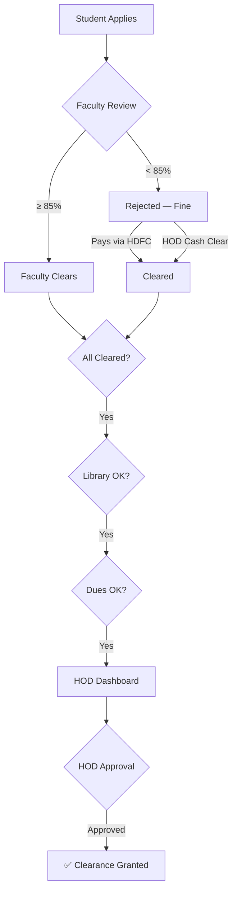
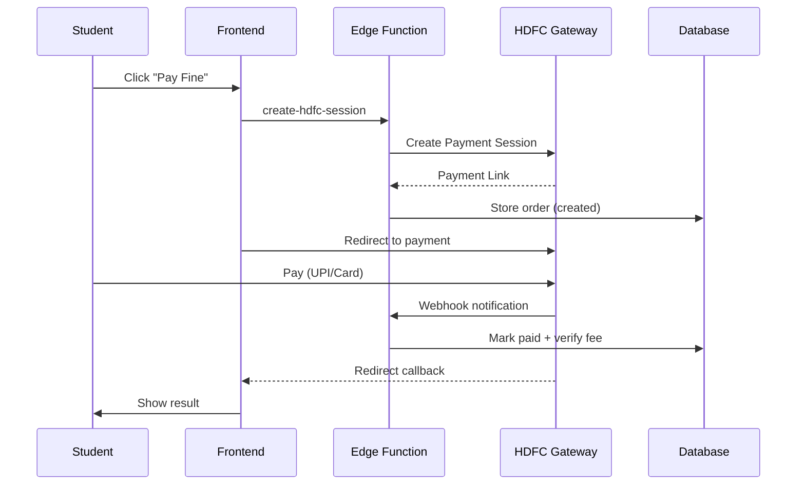

<p align="center">
  
  
  
  
  
  
</p>

<h1 align="center">🎓 NOC Portal — No Objection Certificate Management System</h1>

<p align="center">
  <strong>A multi-tenant SaaS platform for automating academic clearance, attendance compliance, and dues management across educational institutions.</strong>
</p>

<p align="center">
  <a href="#-features">Features</a> •
  <a href="#%EF%B8%8F-architecture">Architecture</a> •
  <a href="#-clearance-workflow">Workflow</a> •
  <a href="#-role-hierarchy">Roles</a> •
  <a href="#-tech-stack">Tech Stack</a> •
  <a href="#-getting-started">Setup</a> •
  <a href="#-security">Security</a>
</p>

---

## 📋 Overview

NOC Portal digitizes the traditional paper-based "No Due Certificate" process used by Indian engineering colleges. Instead of students physically visiting 8+ departments to collect signatures, the entire clearance pipeline — from faculty attendance verification to HOD final approval — happens in a single web application.

**Built for scale:** The platform is multi-tenant, meaning a single deployment serves multiple colleges with complete data isolation.

---

## ✨ Features

### 🎯 Core Features

| Feature | Description |
|---------|-------------|
| **Automated Clearance Pipeline** | Faculty → Library → Accounts → HOD — enforced at database level |
| **Attendance Compliance** | Strict 85% attendance + 2 IA minimum rule with server-side guards |
| **Online Fine Payments** | HDFC SmartGateway-powered payments (UPI, Cards, NetBanking) |
| **Bulk Operations** | CSV upload for students, attendance, dues — up to 500 records per batch |
| **Multi-Tenant SaaS** | One deployment, multiple colleges, complete data isolation |
| **Super Admin Portal** | Platform-level management for onboarding new institutions |

### 📊 Role-Based Dashboards

| Dashboard | Capabilities |
|-----------|-------------|
| **Student** | View clearance status, pay fines online, track IA attendance, view clearance report |
| **Faculty** | Manage attendance per subject, upload IA data via CSV, approve/reject clearance |
| **Staff** | Department-wide student management, fine overrides, attendance due assignments |
| **Clerk** | First/second year student management, subject enrollment, section management |
| **HOD** | Final clearance approval, teacher assignment monitoring, staff activity logs, cash fine clearing |
| **Accounts** | College-wide dues management, fee verification, fine category configuration |
| **FYC** | Cross-department management for Sem 1 & 2 students |
| **Librarian** | Library dues tracking, bulk processing, permit management |
| **Admin** | Full institution control — users, subjects, departments, semesters, assignments |
| **Super Admin** | Platform management — tenant provisioning, error logs, system health |

### 🔔 Additional Features

- 🌙 **Dark/Light Theme** — Per-user theme preference synced to database
- 📱 **Responsive Design** — Works on desktop, tablet, and mobile
- 📄 **PDF Receipt Generation** — Auto-generated payment receipts with jsPDF
- 📊 **Activity Audit Logs** — Every action logged with user, role, timestamp
- ⏰ **Session Management** — Auto-logout after 15 min inactivity with warning
- 🔄 **Real-time Data** — React Query for smart caching and background refetching
- 🔐 **PKCE Auth Flow** — Secure OAuth with Proof Key for Code Exchange
- 🚩 **Report an Issue** — Global issue reporting system for all users with SuperAdmin dashboard

---

### 🚩 Report an Issue System

A built-in issue tracking system that enables any authenticated user to report problems directly from their dashboard.

**User-Facing:** Global Report button, smart form with category/severity selection, auto-collection of browser info, instant feedback on submission.

**SuperAdmin Dashboard:** Summary cards, advanced filters (status/severity/tenant/date), sortable table with expandable rows, status management, environment details per issue.

**Database Table:** `reported_issues` with RLS policies ensuring users can only see their own reports, while SuperAdmins have full access.

---

## 🏗️ Architecture

### System Architecture

```
┌─────────────────────────────────────────────────────────────────┐
│                        CLIENT (Browser)                         │
│  ┌──────────┐  ┌──────────────┐  ┌──────────┐  ┌────────────┐  │
│  │  React   │  │  React Query │  │  Router   │  │   HDFC     │  │
│  │  19 SPA  │  │  (Caching)   │  │  (v7)     │  │  SmartPay  │  │
│  └────┬─────┘  └──────┬───────┘  └────┬─────┘  └─────┬──────┘  │
│       └───────────────┼──────────────┼─────────────┘          │
└───────────────────────┼──────────────────────────────────────────┘
                        │ HTTPS (JWT + Anon Key)
┌───────────────────────┼──────────────────────────────────────────┐
│                 SUPABASE PLATFORM                                │
│  ┌─────────────────────▼─────────────────────────┐               │
│  │              Supabase Auth (PKCE)             │               │
│  └─────────────────────┬─────────────────────────┘               │
│  ┌─────────────────────▼─────────────────────────┐               │
│  │            Edge Functions (Deno)               │               │
│  │  create-user, bulk-create-users,               │               │
│  │  create-hdfc-session, hdfc-webhook,            │               │
│  │  hdfc-order-status, provision-tenant,          │               │
│  │  log-error, admin-api                          │               │
│  └─────────────────────┬─────────────────────────┘               │
│  ┌─────────────────────▼─────────────────────────┐               │
│  │          PostgreSQL + Row Level Security       │               │
│  │  90+ RLS Policies │ 20+ RPCs │ Triggers       │               │
│  │  Tables: profiles, subjects, enrollments,      │               │
│  │  clearance_requests, dues, payments, logs      │               │
│  └────────────────────────────────────────────────┘               │
└──────────────────────────────────────────────────────────────────┘
```

### Multi-Tenant Data Isolation

```
┌─────────────────────────────────────────────────┐
│              Single PostgreSQL DB                │
│  ┌──────────────┐  ┌──────────────┐              │
│  │  Tenant A     │  │  Tenant B     │             │
│  │  tenant_id=A  │  │  tenant_id=B  │             │
│  │  profiles     │  │  profiles     │             │
│  │  subjects     │  │  subjects     │             │
│  └──────────────┘  └──────────────┘              │
│  RLS: WHERE tenant_id = get_my_tenant_id()       │
└─────────────────────────────────────────────────┘
```

---

## 🔄 Clearance Workflow

### Faculty Clearance Paths

| Path | How | Who |
|------|-----|-----|
| **Fine Payment** | Student pays attendance fine via HDFC SmartGateway | Student |
| **Faculty Clear** | Faculty directly marks subject as cleared (attendance ≥ 85%) | Faculty |
| **HOD Override** | HOD clears the subject via cash payment collection | HOD |

> **Rule:** A student with attendance < 85% is automatically rejected with a fine.

### HOD Approval Prerequisites

| Prerequisite | Condition |
|-------------|-----------|
| ✅ **Faculty Clearance** | All enrolled subjects cleared |
| ✅ **Library Clearance** | No pending library dues, OR permitted |
| ✅ **College Dues** | All college fees paid, OR permitted |

### Pipeline Diagram



### Payment Flow (HDFC SmartGateway)



### Server-Enforced Rules

| Rule | Enforcement |
|------|-------------|
| Attendance ≥ 85% | DB trigger + API guard |
| ≥ 2 IAs attended | DB trigger + API guard |
| No unpaid dues | Clearance state machine RPC |
| No unpaid fines | Enrollment fee_verified check |

---

## 👥 Role Hierarchy

```
Super Admin (Platform Level)
    │
    ├── Admin (Institution Level)
    │     ├── Principal (View-only oversight)
    │     ├── HOD (Department head — final clearance)
    │     │     ├── Staff (Department operations)
    │     │     │     ├── Faculty/Teacher (Subject-level)
    │     │     │     └── Clerk (Student management)
    │     │     └── Faculty/Teacher
    │     ├── Accounts (Financial management)
    │     ├── Librarian (Library dues)
    │     └── FYC (First Year Coordinator)
    │           └── Clerk (Sem 1 & 2 only)
    │
    └── Student (Self-service)
```

---

## 🛠 Tech Stack

### Frontend
| Technology | Purpose |
|-----------|---------|
| **React 19** | UI framework |
| **TypeScript 5.9** | Type-safe development |
| **Vite 8** | Build tool and dev server |
| **TailwindCSS 3.4** | Utility-first styling |
| **React Router 7** | Client-side routing |
| **React Query 5** | Server state management and caching |
| **Lucide React** | Icon library |
| **jsPDF** | PDF receipt generation |
| **PapaParse** | CSV parsing for bulk operations |

### Backend
| Technology | Purpose |
|-----------|---------|
| **Supabase** | BaaS (Auth, DB, Edge Functions) |
| **PostgreSQL** | Primary database with RLS |
| **Edge Functions (Deno)** | Serverless API endpoints |
| **90+ RLS Policies** | Database-level access control |
| **20+ RPCs** | Atomic server-side operations |

### Payments & Infrastructure
| Technology | Purpose |
|-----------|---------|
| **HDFC SmartGateway** | UPI, Cards, NetBanking |
| **Vercel / Netlify** | Frontend hosting with CDN |
| **GitHub** | Version control and CI/CD |

---

## 🚀 Getting Started

### Prerequisites
- Node.js 18+ / npm 9+
- Supabase account
- HDFC SmartGateway merchant account (optional for dev)

### Installation

```bash
# Clone the repository
git clone https://github.com/visheshdevanur/NOC-Portal.git
cd NOC-Portal

# Install dependencies
npm install

# Set up environment variables
cp .env.example .env
```

### Environment Variables

```env
# Frontend (safe to expose in browser)
VITE_SUPABASE_URL=https://your-project.supabase.co
VITE_SUPABASE_ANON_KEY=your_anon_key
```

> **⚠️ NEVER** put service_role key, HDFC credentials, or any secret in VITE_ prefixed variables. All secrets go in Supabase Edge Function secrets only.

### Development

```bash
npm run dev      # Start dev server
npm run build    # Production build
npm run preview  # Preview production build
npm run lint     # Run linting
```

### Database Setup

```bash
# Link your Supabase project
supabase link --project-ref your-project-ref

# Apply all 108 migrations
supabase db push --linked
```

### Edge Functions Deployment

```bash
# User management
supabase functions deploy create-user --no-verify-jwt
supabase functions deploy bulk-create-users --no-verify-jwt

# HDFC SmartGateway
supabase functions deploy create-hdfc-session
supabase functions deploy hdfc-order-status --no-verify-jwt
supabase functions deploy hdfc-webhook --no-verify-jwt

# Platform management
supabase functions deploy provision-tenant --no-verify-jwt
supabase functions deploy log-error --no-verify-jwt
supabase functions deploy admin-api --no-verify-jwt
```

### Edge Function Secrets

Set in Supabase Dashboard → Settings → Edge Functions → Secrets:

```
SUPABASE_SERVICE_ROLE_KEY=your_service_role_key

# HDFC SmartGateway
HDFC_MERCHANT_ID=your_merchant_id
HDFC_API_KEY=your_api_key
HDFC_PAYMENT_PAGE_CLIENT_ID=your_client_id
HDFC_BASE_URL=https://smartgateway.hdfcbank.com
HDFC_WEBHOOK_USERNAME=your_webhook_username
HDFC_WEBHOOK_PASSWORD=your_webhook_password
PAYMENT_RETURN_URL=https://your-domain.com/payment/callback
ALLOWED_ORIGIN=https://your-domain.com
```

---

## 📖 User Manual

### 🔑 Logging In

1. Open the portal URL → Enter email and password → Click **Sign In**
2. Auto-redirected to your role-specific dashboard

> **Session Timeout:** Auto-logout after 15 min inactivity. Warning at 12 min.

> **Theme:** Click ⚙️ Settings to switch Dark/Light mode.

---

### 🎓 Student Dashboard

**Clearance Pipeline:** Four stages — Faculty → Library → Accounts → HOD Approval. Each shows ✅ cleared, ⏳ pending, or 🔴 blocked.

**Applying:** Click "Apply for Clearance" → auto-enrolls in all semester subjects → enters pipeline.

**Academic Eligibility:** Must have ≥ 85% attendance AND ≥ 2/3 IAs present per subject.

**Paying Fines:** Attendance < 85% triggers auto-fine → Pay individually or "Pay All" via HDFC SmartGateway (UPI/Card/NetBanking) → auto-cleared on success.

**Library & Dues:** Shows Cleared/Pending/Permitted status for library and college dues.

**NOC Report:** Available once all four stages cleared → generates PDF with clearance details.

> **Disclaimer:** If there is no fine set for your shortage of attendance, then please meet your HoD.

---

### 👨‍🏫 Faculty Dashboard

**Two Tabs:** Student Clearance + Manage IAs

**Student Clearance:** Navigate Department → Semester → Section → Subject → Set attendance % → Auto-evaluates (≥85% + 2 IAs = ✅, <85% = ❌ + fine). Supports bulk CSV upload.

**Manage IAs:** Record up to 3 IAs per subject/section. Students default to Present; toggle Absent as needed. Supports CSV upload.

---

### 🏢 Staff Dashboard

**Tabs:** Student Management | Subject Management | Teacher Assignment | Student Dues | Attendance Fines

- View/filter students by semester and section
- Add subjects, assign teachers to subject+section combinations
- Set/clear/permit college fee dues
- Configure fine slabs and process bulk fines

---

### 📋 Clerk Dashboard

Same capabilities as Staff but scoped to **Semester 1 and 2 only** (first-year students). Cannot see/manage Sem 3+ students.

---

### 👔 HOD Dashboard

**Tabs:** Clearance Approvals | Student Overview | Staff & Teachers | Student Dues | Cash Fine Clearing | Activity Logs | Attendance Fines

**Final Approval:** Only students with ALL prerequisites met appear → Review → Approve/Reject.

**Cash Fine Clearing:** Clear fines paid in cash (bypasses online payment).

**Dues:** Set Due / Permit (with duration) / Clear for individual students.

---

### 💰 Accounts Dashboard

**Tabs:** All Student Dues | Approved/Cleared | Attendance Fines

Manage college-wide dues: Set Due / Permit / Clear / Edit Fee. Supports bulk CSV operations.

---

### 📚 Library Dashboard

Manage library dues: Set Due / Permit / Clear / Set Fine. Bulk CSV upload marks non-returners as "Has Dues" and others as "Cleared."

---

### 🎓 FYC Dashboard

Cross-department management for **Sem 1 & 2** students. Same clearance approval authority as HOD but across all departments for first-year only.

---

### ⚙️ Admin Dashboard

**Tabs:** Users | Departments | Semesters | Subjects | Teacher Assignment | Bulk Import

Full institution control. Create users (single or CSV batch up to 500). Setup workflow: Department → Semesters → Subjects → Teacher Assignment.

---

### 🌐 Super Admin Dashboard

Platform-level management: Tenant provisioning, error logs, issue tracker, system health monitoring.

---

### ❓ FAQ

| Question | Answer |
|----------|--------|
| Applied but nothing happened? | Faculty must mark attendance/IA first |
| Above 85% but "Not Eligible"? | Need ≥ 2/3 IAs present too |
| Paid but still "Pending"? | Wait 30s and refresh; check HDFC status |
| Library/Accounts "Pending" but no dues? | Ask staff to click "Clear" on your record |
| HOD can't see student? | All 3 prerequisites must be met |
| Password change? | Settings → Supabase password reset |

---

## 🔐 Security

### Authentication & Authorization
- **PKCE OAuth flow** — Prevents authorization code interception
- **JWT sessions** — Auto-refresh with 15-min inactivity timeout
- **Role hierarchy enforcement** — RLS-based, staff can't create admins
- **Role escalation prevention** — Database trigger blocks direct role changes

### Database Security
- **90+ RLS policies** — Every table has row-level security
- **Tenant isolation** — All queries scoped via `get_my_tenant_id()`
- **Cross-tenant guards** — RPCs validate caller's tenant
- **State machine enforcement** — Clearance stages advance sequentially
- **Fee self-verification block** — Students can't mark own fines paid

### Payment Security
- **RSA signature verification** — HDFC webhook responses verified
- **Stale order auto-expiry** — Orders >30min automatically expired
- **Atomic processing** — Database-level locking prevents double-processing
- **No PCI data stored** — HDFC handles all card data

### Infrastructure Security
- **Security headers** — CSP, HSTS, X-Frame-Options, Permissions-Policy
- **Immutable asset caching** — Versioned bundles
- **No secrets in frontend** — Only anon key exposed
- **Input sanitization** — Client-side XSS prevention

---

## 📁 Project Structure

```
NOC-Portal/
├── src/
│   ├── App.tsx                      # Root component + routing
│   ├── main.tsx                     # Entry point
│   ├── index.css                    # Global styles + design tokens
│   ├── components/
│   │   ├── dashboard/
│   │   │   ├── StudentDashboard.tsx
│   │   │   ├── FacultyDashboard.tsx
│   │   │   ├── StaffDashboard.tsx
│   │   │   ├── ClerkDashboard.tsx
│   │   │   ├── HodDashboard.tsx
│   │   │   ├── AdminDashboard.tsx
│   │   │   ├── AccountsDashboard.tsx
│   │   │   ├── FycDashboard.tsx
│   │   │   ├── CoeDashboard.tsx
│   │   │   └── shared/
│   │   │       ├── AttendanceFinesTab.tsx
│   │   │       ├── StudentDuesOverviewTab.tsx
│   │   │       └── DashboardPrimitives.tsx
│   │   ├── layout/Layout.tsx
│   │   ├── ErrorBoundary.tsx
│   │   ├── TabErrorBoundary.tsx
│   │   ├── ReportIssueModal.tsx
│   │   ├── ThemeProvider.tsx
│   │   └── ThemeToggle.tsx
│   ├── lib/
│   │   ├── api/                      # Domain-specific API modules
│   │   │   ├── student.ts, faculty.ts, hod.ts
│   │   │   ├── accounts.ts, admin.ts, library.ts
│   │   │   ├── payment.ts, promotion.ts, coe.ts
│   │   │   ├── issues.ts, shared.ts, clearance.ts
│   │   │   └── index.ts
│   │   ├── supabase.ts               # Supabase client init
│   │   ├── useAuth.ts                # Auth hook + session management
│   │   ├── useApiMutation.ts         # Mutation hook wrapper
│   │   ├── useTenant.tsx             # Multi-tenant context
│   │   ├── queryClient.ts            # React Query config
│   │   ├── sanitize.ts              # Input sanitization
│   │   ├── csvSanitizer.ts          # CSV sanitization
│   │   ├── errorHandler.ts          # Global error handler
│   │   ├── invokeWithRetry.ts       # Edge function retry logic
│   │   ├── database.types.ts        # Auto-generated DB types
│   │   ├── superAdminApi.ts         # SuperAdmin API
│   │   ├── superAdminAuth.ts        # SuperAdmin auth
│   │   └── superAdminSupabase.ts    # SuperAdmin client
│   └── pages/
│       ├── DashboardRouter.tsx       # Role-based routing
│       ├── Login.tsx                 # Auth page
│       ├── UpdatePassword.tsx        # Password reset
│       ├── PaymentCallback.tsx       # HDFC return handler
│       ├── LibraryDashboard.tsx      # Library management
│       ├── Logs.tsx                  # Activity logs
│       └── superadmin/
│           ├── SuperAdminApp.tsx
│           ├── SuperAdminDashboard.tsx
│           ├── SuperAdminLogin.tsx
│           ├── CreateTenantModal.tsx
│           ├── TenantDetailModal.tsx
│           ├── ErrorLogPage.tsx
│           ├── ReportedIssuesPage.tsx
│           └── superadmin.css
├── supabase/
│   ├── functions/                    # 8 Edge Functions (Deno)
│   │   ├── create-user/
│   │   ├── bulk-create-users/
│   │   ├── create-hdfc-session/
│   │   ├── hdfc-order-status/
│   │   ├── hdfc-webhook/
│   │   ├── provision-tenant/
│   │   ├── log-error/
│   │   ├── admin-api/
│   │   └── _shared/
│   └── migrations/                   # 108 SQL migration files
├── package.json
├── vercel.json                       # Vercel config + security headers
├── netlify.toml                      # Netlify config + security headers
├── tailwind.config.js
├── vite.config.ts
└── tsconfig.json
```

---

## 📊 Database Schema

### Core Tables

| Table | Purpose |
|-------|---------|
| `tenants` | Multi-tenant organization registry |
| `profiles` | All users linked to Supabase Auth |
| `departments` | Academic departments |
| `semesters` | Semester definitions |
| `subjects` | Course catalog |

### Workflow Tables

| Table | Purpose |
|-------|---------|
| `subject_enrollment` | Student-subject-teacher mappings + attendance |
| `ia_attendance` | Internal assessment attendance records |
| `clearance_requests` | Student clearance applications |
| `student_dues` | College fee status |
| `library_dues` | Library fine status |
| `attendance_fine_categories` | Fine slab configuration |
| `imported_teachers` | Cross-department teacher sharing |

### Payment & System Tables

| Table | Purpose |
|-------|---------|
| `payment_orders` | HDFC payment order tracking |
| `activity_logs` | Audit trail |
| `platform_error_logs` | System error monitoring |
| `reported_issues` | User-reported issue tracking |

---

## 📈 Scaling

| Scale | Architecture | Capacity |
|-------|-------------|----------|
| 1-10 colleges | Supabase Free/Pro + Vercel | ~10,000 users |
| 10-50 colleges | Supabase Pro ($25/mo) | ~50,000 users |
| 50-100 colleges | Supabase Team + Read Replicas | ~200,000 users |
| 100+ colleges | Custom PostgreSQL + Pooling | Unlimited |

---

## 🎯 Key Benefits

**For Students:** No physical visits, real-time tracking, online payments, auto-receipts, transparent IA visibility.

**For Faculty:** Bulk CSV uploads, automated compliance checking, per-section management, batched operations.

**For Administration:** Complete audit trail, automated fine collection, department analytics, 10 distinct roles, bulk onboarding (500/batch).

**For Institutions:** Zero infrastructure (SaaS), works on any device, complete data isolation, paperless process.

---

## 🤝 Contributing

1. Fork the repository
2. Create a feature branch (`git checkout -b feature/your-feature`)
3. Commit your changes (`git commit -m 'feat: add your feature'`)
4. Push to the branch (`git push origin feature/your-feature`)
5. Open a Pull Request

---

## 📄 License

This project is proprietary software. All rights reserved.

---

<p align="center">
  <strong>Built with ❤️ for Indian educational institutions</strong>
</p>
