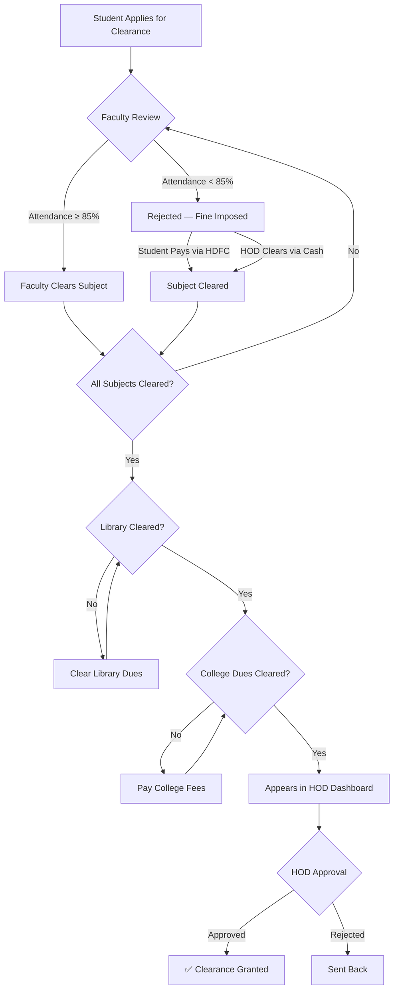
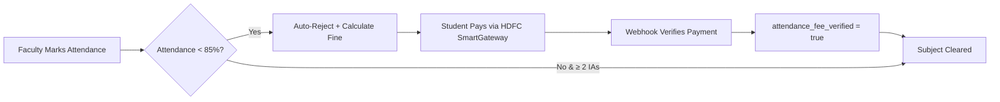
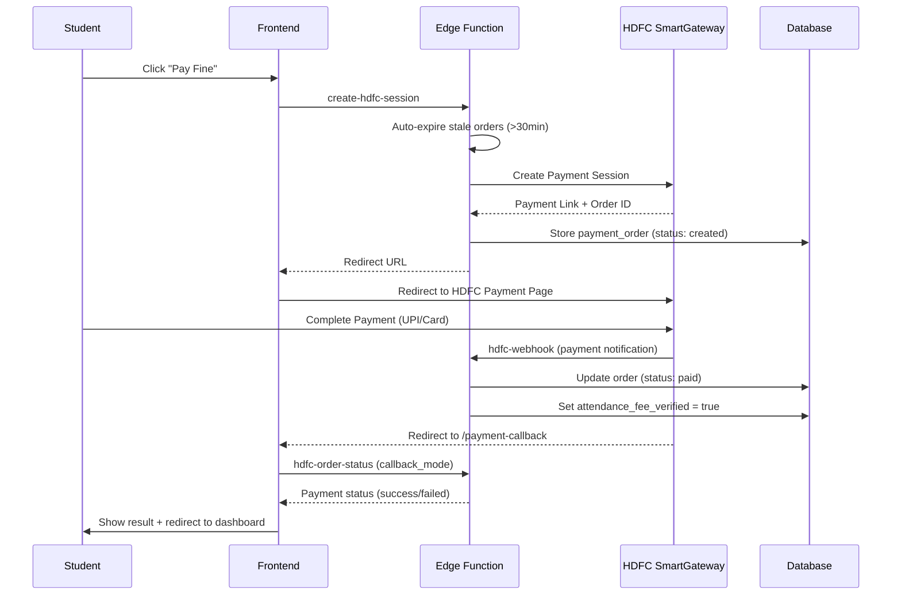

<p align="center">
  
  
  
  
  
  
</p>

<h1 align="center">🎓 NOC Portal — No Objection Certificate Management System</h1>

<p align="center">
  <strong>A multi-tenant SaaS platform for automating academic clearance, attendance compliance, and dues management across educational institutions.</strong>
</p>

<p align="center">
  <a href="#-features">Features</a> •
  <a href="#%EF%B8%8F-architecture">Architecture</a> •
  <a href="#-clearance-workflow">Workflow</a> •
  <a href="#-role-hierarchy">Roles</a> •
  <a href="#-tech-stack">Tech Stack</a> •
  <a href="#-getting-started">Setup</a> •
  <a href="#-security">Security</a>
</p>

---

## 📋 Overview

NOC Portal digitizes the traditional paper-based "No Due Certificate" process used by Indian engineering colleges. Instead of students physically visiting 8+ departments to collect signatures, the entire clearance pipeline — from faculty attendance verification to HOD final approval — happens in a single web application.

**Built for scale:** The platform is multi-tenant, meaning a single deployment serves multiple colleges with complete data isolation.

---

## ✨ Features

### 🎯 Core Features

| Feature | Description |
|---------|-------------|
| **Automated Clearance Pipeline** | Faculty → Library → Accounts → HOD — enforced at database level |
| **Attendance Compliance** | Strict 85% attendance + 2 IA minimum rule with server-side guards |
| **Online Fine Payments** | HDFC SmartGateway-powered payments (UPI, Cards, NetBanking) |
| **Bulk Operations** | CSV upload for students, attendance, dues — up to 500 records per batch |
| **Multi-Tenant SaaS** | One deployment, multiple colleges, complete data isolation |
| **Super Admin Portal** | Platform-level management for onboarding new institutions |

### 📊 Role-Based Dashboards

| Dashboard | Capabilities |
|-----------|-------------|
| **Student** | View clearance status, pay fines online, track IA attendance, view clearance report |
| **Faculty** | Manage attendance per subject, upload IA data via CSV, approve/reject clearance |
| **Staff** | Department-wide student management, fine overrides, attendance due assignments |
| **Clerk** | First/second year student management, subject enrollment, section management |
| **HOD** | Final clearance approval, teacher assignment monitoring, staff activity logs, cash fine clearing |
| **Accounts** | College-wide dues management, fee verification, fine category configuration |
| **FYC (First Year Coordinator)** | Cross-department management for Sem 1 & 2 students |
| **Librarian** | Library dues tracking, bulk processing, permit management |
| **Admin** | Full institution control — users, subjects, departments, semesters, assignments |
| **Super Admin** | Platform management — tenant provisioning, error logs, system health |

### 🔔 Additional Features

- 🌙 **Dark/Light Theme** — Per-user theme preference synced to database
- 📱 **Responsive Design** — Works on desktop, tablet, and mobile
- 📄 **PDF Receipt Generation** — Auto-generated payment receipts with jsPDF
- 📊 **Activity Audit Logs** — Every action logged with user, role, timestamp
- ⏰ **Session Management** — Auto-logout after 15 min inactivity with warning
- 🔄 **Real-time Data** — React Query for smart caching and background refetching
- 🔐 **PKCE Auth Flow** — Secure OAuth with Proof Key for Code Exchange
- 🚩 **Report an Issue** — Global issue reporting system for all users with SuperAdmin dashboard

---

### 🚩 Report an Issue System

A built-in issue tracking system that enables any authenticated user to report problems directly from their dashboard.

**User-Facing Features:**
- **Global Access** — A "Report" button is visible in the top navigation bar and Settings menu on every page
- **Smart Form** — Users select a category (UI Bug, Performance, Wrong Data, Feature Broken, Access Issue, Other), severity level, and write a description
- **Auto-Collection** — Browser, OS, screen resolution, and current page URL are captured automatically
- **Instant Feedback** — Success confirmation shown immediately after submission

**Developer/SuperAdmin Dashboard:**
- **Summary Cards** — Total, Open, In Progress, and Resolved issue counts at a glance
- **Advanced Filters** — Filter by status, severity, tenant, and date range; full-text search
- **Sortable Table** — Click any column header to sort; expandable rows show full details
- **Status Management** — Change issue status (Open → In Progress → Resolved) directly from the table
- **Environment Details** — Browser info, OS, screen resolution, and exact URL per issue

**Database Table:** `reported_issues` with RLS policies ensuring users can only see their own reports, while SuperAdmins have full access.

---

## 🏗️ Architecture

### System Architecture

```
┌─────────────────────────────────────────────────────────────────┐
│                        CLIENT (Browser)                         │
│  ┌──────────┐  ┌──────────────┐  ┌──────────┐  ┌────────────┐  │
│  │  React   │  │  React Query │  │  Router   │  │   HDFC     │  │
│  │  19 SPA  │  │  (Caching)   │  │  (v7)     │  │  SmartPay  │  │
│  └────┬─────┘  └──────┬───────┘  └────┬─────┘  └─────┬──────┘  │
│       └───────────────┼──────────────┼─────────────┘          │
└───────────────────────┼──────────────────────────────────────────┘
                        │ HTTPS (JWT + Anon Key)
┌───────────────────────┼──────────────────────────────────────────┐
│                 SUPABASE PLATFORM                                │
│                        │                                         │
│  ┌─────────────────────▼─────────────────────────┐               │
│  │              Supabase Auth (PKCE)             │               │
│  │         JWT Token + Session Management         │               │
│  └─────────────────────┬─────────────────────────┘               │
│                        │                                         │
│  ┌─────────────────────▼─────────────────────────┐               │
│  │            Edge Functions (Deno)               │               │
│  │  ┌──────────────┐  ┌───────────────────────┐  │               │
│  │  │ create-user  │  │ create-hdfc-session   │  │               │
│  │  │ bulk-create  │  │ hdfc-webhook          │  │               │
│  │  │ provision-   │  │ hdfc-order-status     │  │               │
│  │  │ tenant       │  │ log-error / admin-api │  │               │
│  │  └──────────────┘  └───────────────────────┘  │               │
│  └─────────────────────┬─────────────────────────┘               │
│                        │                                         │
│  ┌─────────────────────▼─────────────────────────┐               │
│  │          PostgreSQL + Row Level Security       │               │
│  │  ┌────────────┐  ┌───────────┐  ┌──────────┐  │               │
│  │  │  90+ RLS   │  │  20+ RPCs │  │ Triggers │  │               │
│  │  │  Policies  │  │  (Atomic) │  │ & Guards │  │               │
│  │  └────────────┘  └───────────┘  └──────────┘  │               │
│  │                                                │               │
│  │  Tables: profiles, subjects, subject_enrollment,│               │
│  │  clearance_requests, student_dues, library_dues,│               │
│  │  ia_attendance, payment_orders, activity_logs,  │               │
│  │  tenants, departments, semesters, notifications │               │
│  └────────────────────────────────────────────────┘               │
└──────────────────────────────────────────────────────────────────┘
```

### Multi-Tenant Data Isolation

```
┌─────────────────────────────────────────────────┐
│              Single PostgreSQL DB                │
│                                                  │
│  ┌──────────────┐  ┌──────────────┐              │
│  │  Tenant A     │  │  Tenant B     │             │
│  │  (MIT Mysore) │  │  (XYZ College)│             │
│  │               │  │               │             │
│  │  tenant_id=A  │  │  tenant_id=B  │             │
│  │  ───────────  │  │  ───────────  │             │
│  │  profiles     │  │  profiles     │             │
│  │  subjects     │  │  subjects     │             │
│  │  enrollments  │  │  enrollments  │             │
│  │  dues         │  │  dues         │             │
│  └──────────────┘  └──────────────┘              │
│                                                  │
│  RLS Policy: WHERE tenant_id = get_my_tenant_id()│
│  RPCs: Cross-tenant access → RAISE EXCEPTION     │
└─────────────────────────────────────────────────┘
```

---

## 🔄 Clearance Workflow

### Two-Step Clearance Process

#### Step 1: Faculty Clearance

A student's subject is considered **faculty-cleared** through any one of three paths:

| Path | How | Who |
|------|-----|-----|
| **Fine Payment** | Student pays attendance fine via HDFC SmartGateway | Student |
| **Faculty Clear** | Faculty directly marks subject as cleared (attendance ≥ 85%) | Faculty |
| **HOD Override** | HOD clears the subject via cash payment collection | HOD |

> **Rule:** A student with attendance < 85% is automatically rejected with a fine. They must pay the fine or get an HOD override to be cleared.

#### Step 2: HOD Approval

A student must first clear **all three prerequisites** before appearing for HOD final approval:

| Prerequisite | Condition |
|-------------|-----------|
| ✅ **Faculty Clearance** | All enrolled subjects are cleared (via any of the 3 paths above) |
| ✅ **Library Clearance** | No pending library dues, OR library dues permitted |
| ✅ **College Dues** | All college fees paid, OR dues permitted |

Only students with **all three** prerequisites met appear in the HOD's clearance tab.

> HOD approval is **department-specific** — students can only be approved by the HOD of their own department. This is the **final step** in the No Due process.

### Clearance Pipeline Diagram



### Clearance Rules (Server-Enforced)

| Rule | Enforcement Level |
|------|-------------------|
| Attendance ≥ 85% | Database trigger + API guard |
| ≥ 2 IAs attended | Database trigger + API guard |
| No unpaid college dues | Clearance state machine RPC |
| No unpaid library dues | Evaluated during clearance check |
| No unpaid attendance fines | Enrollment status + fee_verified check |
| HOD sees only eligible students | Client-side prerequisite filtering |

### Attendance Fine Workflow



### Payment Flow (HDFC SmartGateway)



---

## 👥 Role Hierarchy

```
Super Admin (Platform Level)
    │
    ├── Admin (Institution Level)
    │     ├── Principal (View-only oversight)
    │     ├── HOD (Department head — final clearance)
    │     │     ├── Staff (Department operations)
    │     │     │     ├── Faculty/Teacher (Subject-level)
    │     │     │     └── Clerk (Student management)
    │     │     └── Faculty/Teacher
    │     ├── Accounts (Financial management)
    │     ├── Librarian (Library dues)
    │     └── FYC (First Year Coordinator)
    │           └── Clerk (Sem 1 & 2 only)
    │
    └── Student (Self-service)
```

---

## 🛠 Tech Stack

### Frontend
| Technology | Purpose |
|-----------|---------|
| **React 19** | UI framework with latest concurrent features |
| **TypeScript 5.9** | Type-safe development |
| **Vite 8** | Lightning-fast build tool and dev server |
| **TailwindCSS 3.4** | Utility-first styling |
| **React Router 7** | Client-side routing |
| **React Query 5** | Server state management, caching, background sync |
| **Lucide React** | Modern icon library |
| **jsPDF** | Client-side PDF receipt generation |
| **PapaParse** | CSV parsing for bulk operations |

### Backend
| Technology | Purpose |
|-----------|---------|
| **Supabase** | Backend-as-a-Service (Auth, DB, Edge Functions) |
| **PostgreSQL** | Primary database with RLS |
| **Edge Functions (Deno)** | Serverless API endpoints |
| **Row Level Security** | Database-level access control (90+ policies) |
| **RPCs** | Atomic server-side operations (20+ functions) |

### Payments
| Technology | Purpose |
|-----------|---------|
| **HDFC SmartGateway** | Payment gateway (UPI, Cards, NetBanking) |
| **RSA + SHA-256** | Payment response signature verification |
| **Callback Mode** | Stateless payment status check (no JWT required) |

### Infrastructure
| Technology | Purpose |
|-----------|---------|
| **Vercel** | Frontend hosting with CDN and auto-deploy |
| **Supabase Cloud** | Managed PostgreSQL + Auth + Edge Functions |
| **GitHub** | Version control and CI/CD triggers |

---

## 🚀 Getting Started

### Prerequisites
- Node.js 18+
- npm 9+
- Supabase account
- HDFC SmartGateway merchant account (for payments)

### Installation

```bash
# Clone the repository
git clone https://github.com/visheshdevanur/NOC-Portal.git
cd NOC-Portal

# Install dependencies
npm install

# Set up environment variables
cp .env.example .env
```

### Environment Variables

```env
# Frontend (safe to expose in browser)
VITE_SUPABASE_URL=https://your-project.supabase.co
VITE_SUPABASE_ANON_KEY=your_anon_key
```

### Development

```bash
# Start dev server
npm run dev

# Build for production
npm run build

# Preview production build
npm run preview

# Run linting
npm run lint
```

### Database Setup

1. Create a Supabase project
2. Run migrations in order:
```bash
# Apply all 102+ migrations
supabase db push --linked
```

### Edge Functions Deployment

```bash
# User management
supabase functions deploy create-user --no-verify-jwt
supabase functions deploy bulk-create-users --no-verify-jwt

# HDFC SmartGateway payment functions
supabase functions deploy create-hdfc-session
supabase functions deploy hdfc-order-status --no-verify-jwt
supabase functions deploy hdfc-webhook --no-verify-jwt

# Platform management
supabase functions deploy provision-tenant --no-verify-jwt
supabase functions deploy log-error --no-verify-jwt
supabase functions deploy admin-api --no-verify-jwt
```

### Edge Function Secrets

Set these in Supabase Dashboard → Settings → Edge Functions → Secrets:
```
SUPABASE_SERVICE_ROLE_KEY=your_service_role_key

# HDFC SmartGateway
HDFC_MERCHANT_ID=your_merchant_id
HDFC_API_KEY=your_api_key
HDFC_PAYMENT_PAGE_CLIENT_ID=your_client_id
HDFC_BASE_URL=https://smartgateway.hdfcbank.com
HDFC_API_BASE_URL=https://api.hdfcbank.com

ALLOWED_ORIGIN=https://your-domain.com
```

---

## 📖 User Manual

This section provides step-by-step instructions for every user role in the NOC Portal.

---

### 🔑 Logging In

1. Open the portal URL in any browser (Chrome, Firefox, Edge, Safari)
2. Enter your **email** and **password** provided by your institution admin
3. Click **Sign In**
4. You will be automatically redirected to your role-specific dashboard

> **Session Timeout:** You will be automatically logged out after 15 minutes of inactivity. A warning appears at 12 minutes.

> **Theme:** Click the ⚙️ **Settings** icon (top-right) to switch between Dark and Light mode.

> **Report an Issue:** If you encounter a bug, click the 🚩 **Report** button in the top navigation bar.

---

### 🎓 Student Dashboard

The Student Dashboard is your one-stop portal for tracking clearance status, paying fines, and downloading your No Due Certificate.

#### Viewing Your Clearance Status

After logging in, you will see the **Clearance Pipeline Match** with four stages:

| Stage | Icon | What It Means |
|-------|------|---------------|
| **Faculty** | 📘 IA + Attendance | Your subject-wise attendance and IA status |
| **Library** | 📖 Books & Fines | Whether you have pending library books or fines |
| **Accounts** | 💰 College Fees | Whether your college dues are cleared |
| **HOD Approval** | 👤 Final Sign-off | Final clearance from your Head of Department |

Each stage shows a ✅ green check when cleared, or a ⏳ pending/🔴 blocked indicator when not.

#### Applying for Clearance

1. Click **"Apply for Clearance"** button
2. The system automatically enrolls you in all subjects for your semester
3. Your clearance request enters the pipeline at **Faculty Review** stage

> **Note:** You only need to apply once. Re-clicking the button is safe — it won't create duplicates.

#### Understanding Academic Eligibility

Under **Academic Eligibility**, you'll see each subject with:

| Field | Requirement |
|-------|-------------|
| **Attendance** | Must be ≥ 85% (marked by your faculty) |
| **IA Attendance** | Must be marked **Present** in at least 2 out of 3 Internal Assessments |

- ✅ **Eligible** — You meet both requirements
- ❌ **Not Eligible** — You are below the threshold; a fine may be imposed

#### Paying Attendance Fines

If your attendance is below 85%, a fine is auto-calculated:

1. Scroll to the **Attendance Dues** section
2. You'll see each subject with a pending fine amount
3. Click **"Pay ₹XXX"** to pay individually, OR click **"Pay All"** to pay all fines at once
4. You'll be redirected to **HDFC SmartGateway** — pay via UPI, Card, or Net Banking
5. After payment, you're redirected back. The subject is automatically marked as **Cleared**

> **Bulk Payment:** Use "Pay All" to settle all pending fines in a single transaction.

#### Viewing Library & College Dues

- **Library Section:** Shows "Cleared" (green) or "Pending" / "Permitted"
- **College Dues Section:** Shows "Cleared", "Pending", or "Permitted"
- "Permitted" means the staff has temporarily allowed your clearance to proceed despite pending dues

#### Downloading Your NOC Report

Once **all four stages** are cleared:

1. A **"Download NOC Report"** button appears
2. Click to generate a PDF receipt with your clearance details
3. The PDF includes: your name, USN, department, semester, clearance date, and approval status

---

### 👨‍🏫 Faculty / Teacher Dashboard

The Faculty Dashboard has two tabs: **Student Clearance** and **Manage IAs**.

#### Tab 1: Student Clearance

This tab lets you manage attendance percentages for students enrolled in your subjects.

**Navigation:** Department → Semester → Section → Subject

1. Select your **Department** from the cards
2. Select the **Semester**
3. Select the **Section**
4. Select the **Subject**
5. You'll see all enrolled students with their current attendance %

**Setting Attendance Individually:**
1. Type the attendance percentage (0–100) in the input field next to each student
2. Click the **Save** button (checkmark icon)
3. The system automatically evaluates:
   - **≥ 85% + 2 IAs present** → Status: ✅ Cleared
   - **< 85%** → Status: ❌ Rejected (fine auto-calculated)
   - **< 2 IAs present** → Status: ❌ Rejected (insufficient IA attendance)

**Bulk Attendance via CSV:**
1. Click **"Download Template"** to get a pre-filled CSV with student names and roll numbers
2. Fill in `total_classes` and `attended_classes` columns
3. Click **"Upload CSV"** and select the filled file
4. All attendance percentages are calculated and statuses are auto-assigned

#### Tab 2: Manage IAs (Internal Assessments)

**Navigation:** Department → Semester → Section → Subject

1. Navigate to your subject (same hierarchy)
2. You'll see the IA panel showing **X / 3 IAs recorded**
3. Click **"+ Add IA-X"** to record a new IA
4. All students default to **Present** — toggle to **Absent** as needed
5. Click **"Save IA-X"**

> **Maximum:** 3 IAs per subject per section. Once all 3 are recorded, the button shows "Max 3 IAs Reached".

**Editing a Previous IA:**
1. Click the chevron (▼) next to an existing IA to expand it
2. Click the ✏️ **Edit** icon
3. Modify attendance (Present/Absent)
4. Click **"Save"**

**IA CSV Upload:**
1. Click **"Download Template"** → get CSV with `roll_number, student_name, status`
2. Fill status column with `Present` or `Absent`
3. Click **"Upload CSV"**

> **Section Isolation:** Each section's IAs are tracked independently. Even if you teach the same subject to Sections A and C, IAs are completely separate.

---

### 🏢 Staff Dashboard

The Staff Dashboard provides department-level operations for managing students, subjects, teachers, and attendance fines.

#### Tabs Overview

| Tab | Purpose |
|-----|---------|
| **Student Management** | View all students in your department, filter by semester/section |
| **Subject Management** | View and manage subjects assigned to your department |
| **Teacher Assignment** | Assign teachers to subjects and sections |
| **Student Dues** | View and manage college fee dues for your department's students |
| **Attendance Fines** | Configure fine slabs and process bulk attendance fines |

#### Student Management
- View all students filtered by semester and section
- See clearance status, roll number, section, and semester

#### Subject Management
- View all subjects with their codes, semesters, and assigned teachers
- Add new subjects for your department

#### Teacher Assignment
- Assign/reassign teachers to specific subject + section combinations
- View current assignments

#### Student Dues
- View pending/cleared college dues for all students
- Set due, clear due, or permit dues for individual students

#### Attendance Fines
- **Configure Fine Categories:** Set fine slabs (e.g., 75–84% → ₹500, 65–74% → ₹1000)
- **Process Bulk Fines:** Upload CSV with student attendance data
- Fines are auto-calculated based on the configured slabs

---

### 📋 Clerk Dashboard

The Clerk Dashboard is similar to the Staff Dashboard but is specifically scoped to **Semester 1 and 2** students.

#### Key Capabilities
- Manage students only in **Sem 1 and Sem 2** (first-year students)
- Upload bulk student data via CSV
- Assign subjects and teachers to sections
- View and manage student dues

> **Scope Restriction:** Clerks cannot see or manage students in Semester 3 and above. Those students are managed by Staff/HOD.

---

### 👔 HOD (Head of Department) Dashboard

The HOD Dashboard is the final clearance authority for students in your department.

#### Tabs Overview

| Tab | Purpose |
|-----|---------|
| **Clearance Approvals** | Approve/reject final clearance for eligible students |
| **Student Overview** | View all students with their clearance pipeline status |
| **Staff & Teachers** | View staff members and teacher assignments |
| **Student Dues** | Manage college fee dues, permit/clear/set dues |
| **Cash Fine Clearing** | Clear fines collected via cash (bypasses online payment) |
| **Activity Logs** | View all staff actions in your department |
| **Attendance Fines** | Configure and manage fine categories |

#### Final Clearance Approval

Only students who have **all three prerequisites** met appear in the Clearance Approvals tab:

1. ✅ All subjects cleared by faculty (attendance ≥ 85% + 2 IAs, or fine paid)
2. ✅ Library dues cleared or permitted
3. ✅ College dues cleared or permitted

**To approve:**
1. Navigate to **Clearance Approvals**
2. Review the student's clearance summary
3. Click **"Approve"** — this marks the student as **Fully Cleared**

> **Cash Fine Clearing:** If a student pays a fine in cash (not online), go to **Cash Fine Clearing** tab, find the student, and click **"Clear"** to bypass the online payment requirement.

#### Student Dues Management

- **Set Due:** Marks a student as having pending college dues (status → Pending)
- **Permit:** Temporarily allows the student to proceed with clearance despite pending dues (status → Permitted). You can set a permit duration (e.g., 2 days, 7 days)
- **Clear:** Marks the student's dues as fully settled (status → Completed)

---

### 💰 Accounts Dashboard

The Accounts Dashboard manages college-wide financial dues across all departments.

#### Tabs Overview

| Tab | Purpose |
|-----|---------|
| **All Student Dues** | View and manage dues for every student across all departments |
| **Approved/Cleared** | View students whose dues are marked as completed |
| **Attendance Fines** | Configure fine categories by department |

#### Managing Student Dues

Each student row shows: Name, Roll Number, Department, Semester, Section, Fine Amount, Paid Amount, Status.

**Actions (via dropdown menu per student):**

| Action | Effect |
|--------|--------|
| **Set Due** | Sets status to **Pending** with the specified fine amount |
| **Permit** | Sets status to **Permitted** for a specified duration (e.g., 2 days). Student can proceed with clearance |
| **Clear** | Sets status to **Completed**. College dues are fully settled |
| **Edit Fee** | Modify the fine amount and paid amount |

**Bulk Operations via CSV:**
1. Download the student dues template
2. Fill in roll numbers and fine amounts
3. Upload — all matching students are updated automatically

> **Status Reflection:** All changes made here are immediately visible on the student's dashboard.

---

### 📚 Library Dashboard

The Library Dashboard manages library dues (unreturned books, fines) for all students.

#### Student List

Each student shows: Name, Roll Number, Department, Status (Has Dues / No Dues / Permitted).

#### Actions (via dropdown menu per student)

| Action | Effect |
|--------|--------|
| **Set Due** | Marks student as having pending library dues (blocks clearance) |
| **Permit** | Permits the student to proceed with clearance despite library dues |
| **Clear** | Clears all library dues for the student |
| **Set Fine** | Assigns a specific fine amount for library violations |

**Bulk Operations via CSV:**
1. Upload a CSV with roll numbers of students who have **NOT** returned books
2. All listed students are marked as "Has Dues"
3. All other students are automatically marked as "Cleared"

> **Status Reflection:** Changes are immediately reflected on the student's dashboard under the "Library" stage.

---

### 🎓 FYC (First Year Coordinator) Dashboard

The FYC Dashboard provides cross-department management specifically for **Semester 1 and 2** students.

#### Tabs Overview

| Tab | Purpose |
|-----|---------|
| **Student Overview** | View all first-year students across all departments |
| **Clearance Approvals** | Final clearance for first-year students (same role as HOD but for Sem 1-2) |
| **Student Dues** | Manage college dues for first-year students |
| **Activity Logs** | View staff actions related to first-year students |
| **Attendance Fines** | Configure fine categories for first-year semesters |

> **Key Difference from HOD:** FYC manages students across **all departments** but only for Sem 1 and Sem 2, while HOD manages **one department** across all semesters.

---

### ⚙️ Admin Dashboard

The Admin Dashboard provides full institutional control.

#### Tabs Overview

| Tab | Purpose |
|-----|---------|
| **Users** | View, search, and manage all user accounts |
| **Departments** | Create and manage academic departments |
| **Semesters** | Create semesters within departments |
| **Subjects** | Create subjects and assign them to semesters |
| **Teacher Assignment** | Assign teachers to subjects across departments |
| **Bulk Import** | Upload student and teacher data via CSV (up to 500 per batch) |

#### Creating Users

1. Go to **Users** tab
2. Click **"+ Add User"**
3. Fill in: Full Name, Email, Password, Role, Department, Semester, Section
4. Click **Create** — the user is created in Supabase Auth + profiles table

#### Bulk User Import

1. Click **"Import CSV"**
2. Download the template → fill in student/teacher details
3. Upload → up to **500 users created per batch**
4. For students: `student_dues` and `library_dues` rows are automatically created

#### Subject Setup Workflow

1. Create **Department** (e.g., "Computer Science")
2. Create **Semesters** within the department (e.g., "1", "2", "3"...)
3. Create **Subjects** within semesters (e.g., "Data Structures", code: "CS301")
4. **Assign Teachers** to subjects + sections

---

### 🌐 Super Admin Dashboard

The Super Admin manages the platform at the multi-tenant level.

#### Capabilities

| Feature | Description |
|---------|-------------|
| **Tenant Management** | Create new college tenants, set quotas, activate/deactivate |
| **Error Logs** | View platform-wide error logs with severity filtering |
| **Issue Tracker** | View and manage user-reported issues across all tenants |
| **System Health** | Monitor tenant usage and database metrics |

#### Creating a New Tenant (College)

1. Click **"+ Create Tenant"**
2. Fill in: College Name, Slug, Admin Email, Plan, Max Users
3. Click **Create** — provisions a new isolated tenant with its own admin

---

### 📱 Common Features (All Roles)

#### Dark / Light Theme
- Click ⚙️ **Settings** icon → Toggle theme
- Preference is saved to your profile

#### Report an Issue
1. Click 🚩 **Report** in the top navigation
2. Select **Category**: UI Bug, Performance, Wrong Data, Feature Broken, Access Issue, Other
3. Select **Severity**: Low, Medium, High, Critical
4. Write a description
5. Click **Submit** — your browser info and current page URL are auto-captured

#### Activity Logs
- Every action (clearance approval, fine assignment, payment, etc.) is logged
- Staff/HOD/Admin can view logs filtered by date, user, and action type

#### Session Security
- Auto-logout after **15 minutes** of inactivity
- Warning banner appears at **12 minutes**
- Click "Stay Logged In" to refresh your session

---

### ❓ Frequently Asked Questions

**Q: I applied for clearance but nothing happened.**
A: Your request is now in the pipeline. Faculty must mark your attendance and IA status first. Check the "Academic Eligibility" section to see your subject-wise status.

**Q: My attendance is above 85% but the subject shows "Not Eligible".**
A: You also need to be present in at least **2 out of 3 IAs**. Check the IA section to verify.

**Q: I paid my fine but the subject still shows "Pending".**
A: Wait 30 seconds and refresh the page. If it still shows pending, check the payment status on the HDFC SmartGateway page. Contact your accounts department if the issue persists.

**Q: The Library/Accounts section shows "Pending" but I have no dues.**
A: Ask your library/accounts staff to click **"Clear"** on your record. If you're a new student, the staff needs to run the clearance action at least once.

**Q: HOD says my clearance isn't showing for approval.**
A: All three prerequisites must be met: (1) All subjects cleared by faculty, (2) Library cleared or permitted, (3) College dues cleared or permitted. Check each stage on your dashboard.

**Q: I'm a faculty member and I see IAs from another section.**
A: This has been fixed. Refresh your browser (Ctrl+F5). IAs are now section-specific.

**Q: How do I change my password?**
A: Go to ⚙️ Settings → Use the Supabase password reset flow, or contact your Admin.

---

## 🔐 Security

### Authentication & Authorization
- **PKCE OAuth flow** — Prevents authorization code interception
- **JWT-based sessions** — Auto-refresh with 15-min inactivity timeout
- **Role hierarchy enforcement** — Staff can't create admins, HODs can't modify other departments
- **Role escalation prevention** — Database trigger blocks direct role changes via UPDATE

### Database Security
- **90+ RLS policies** — Every table has row-level security
- **Tenant isolation** — All queries scoped to `tenant_id` via `get_my_tenant_id()`
- **Cross-tenant guards** — All RPCs validate caller's tenant matches target data
- **State machine enforcement** — Clearance stages can only advance sequentially
- **Fee self-verification block** — Students cannot mark their own fines as paid

### Payment Security
- **RSA signature verification** — HDFC webhook responses verified with public key
- **Stale order auto-expiry** — Orders older than 30 minutes automatically expired
- **Callback mode** — Stateless payment status check using `order_id` as implicit token
- **No JWT required for callbacks** — Handles expired sessions after payment redirect
- **Atomic payment processing** — Database-level locking prevents double-processing

### API Security
- **Edge Functions validate JWTs** — Every call verified server-side
- **Rate limiting** — 5 requests/minute + 20/day on payment endpoints
- **Origin validation** — Edge Functions reject cross-origin requests
- **Input sanitization** — Client-side XSS prevention on all user inputs

### Infrastructure Security
- **Security headers** — CSP, HSTS, X-Frame-Options, Permissions-Policy
- **Immutable asset caching** — Versioned bundles with cache-busting
- **No secrets in frontend** — Only publishable keys exposed; secrets in Edge Functions only
- **`.env` in `.gitignore`** — Environment files excluded from version control

---

## 📁 Project Structure

```
NOC-Portal/
├── src/
│   ├── App.tsx                      # Root component + routing
│   ├── main.tsx                     # Entry point
│   ├── index.css                    # Global styles + design tokens
│   ├── components/
│   │   ├── dashboard/
│   │   │   ├── StudentDashboard.tsx   # Student self-service portal
│   │   │   ├── FacultyDashboard.tsx   # Attendance + clearance management
│   │   │   ├── StaffDashboard.tsx     # Department operations
│   │   │   ├── ClerkDashboard.tsx     # Student enrollment management
│   │   │   ├── HodDashboard.tsx       # Final approvals + oversight
│   │   │   ├── AdminDashboard.tsx     # Institution admin panel
│   │   │   ├── AccountsDashboard.tsx  # Financial management
│   │   │   ├── FycDashboard.tsx       # First Year Coordinator
│   │   │   └── shared/               # Shared dashboard components
│   │   ├── layout/                    # Sidebar, header, navigation
│   │   ├── ErrorBoundary.tsx          # Crash recovery
│   │   └── ThemeProvider.tsx          # Dark/light mode
│   ├── lib/
│   │   ├── api/                       # Domain-specific API modules
│   │   │   ├── student.ts             # Student queries
│   │   │   ├── faculty.ts             # Faculty operations (batched upserts)
│   │   │   ├── hod.ts                 # HOD operations (prerequisite filtering)
│   │   │   ├── accounts.ts            # Financial operations
│   │   │   ├── admin.ts               # Admin operations
│   │   │   ├── library.ts             # Library dues
│   │   │   ├── payment.ts             # HDFC SmartGateway integration
│   │   │   ├── promotion.ts           # Student promotion
│   │   │   └── shared.ts              # Activity logs + utilities
│   │   ├── supabase.ts                # Supabase client init
│   │   ├── useAuth.ts                 # Auth hook + session management
│   │   └── sanitize.ts               # Input sanitization utilities
│   ├── pages/
│   │   ├── DashboardRouter.tsx        # Role-based dashboard routing
│   │   ├── Login.tsx                  # Auth page (OTP + password)
│   │   ├── PaymentCallback.tsx        # HDFC payment return handler
│   │   ├── LibraryDashboard.tsx       # Library management
│   │   └── superadmin/                # Platform admin portal
│   │       ├── SuperAdminApp.tsx       # SA routing
│   │       ├── SuperAdminDashboard.tsx # Tenant management
│   │       ├── CreateTenantModal.tsx   # College onboarding
│   │       ├── TenantDetailModal.tsx   # Tenant configuration
│   │       └── ErrorLogPage.tsx        # Platform error monitoring
│   └── types/                         # TypeScript type definitions
├── supabase/
│   ├── functions/                     # Edge Functions (Deno)
│   │   ├── create-user/               # Single user creation
│   │   ├── bulk-create-users/         # CSV batch user creation (500/batch)
│   │   ├── create-hdfc-session/       # HDFC payment session creation
│   │   ├── hdfc-order-status/         # Payment status check (callback_mode)
│   │   ├── hdfc-webhook/              # Payment verification webhook
│   │   ├── provision-tenant/          # New college onboarding
│   │   ├── log-error/                 # Error reporting
│   │   ├── admin-api/                 # Admin operations
│   │   └── _shared/                   # Shared utilities (CORS, rate limit)
│   └── migrations/                    # 102+ SQL migrations
│       ├── 0001_initial_schema.sql
│       ├── ...
│       ├── 0072_multi_tenant_schema.sql
│       ├── 0078_critical_security_patches.sql
│       ├── 0091_hdfc_smartgateway_migration.sql
│       ├── 0094_fix_payment_orders_and_bulk.sql
│       ├── 0096_reported_issues.sql
│       ├── 0099_fix_accounts_library_new_students.sql
│       └── 0102_combined_new_student_fix.sql
├── vercel.json                        # Vercel hosting config (SPA routing)
├── netlify.toml                       # Netlify hosting config (backup)
├── package.json
├── tsconfig.json
└── tailwind.config.js
```

---

## 📊 Database Schema (Key Tables)

| Table | Purpose | Rows (est.) |
|-------|---------|-------------|
| `tenants` | Institution registry | 1 per college |
| `profiles` | All users (students + staff) | 500-5000 per tenant |
| `departments` | Academic departments | 5-15 per tenant |
| `semesters` | Semester definitions | 8-10 per tenant |
| `subjects` | Course catalog | 50-200 per tenant |
| `subject_enrollment` | Student-subject-teacher mapping | 2000-20000 per tenant |
| `ia_attendance` | IA exam attendance records | 5000-50000 per tenant |
| `clearance_requests` | Clearance applications | 1 per student |
| `student_dues` | College fee status | 1 per student |
| `library_dues` | Library fine status | 1 per student |
| `payment_orders` | HDFC payment records | Variable |
| `attendance_fine_categories` | Fine slab configuration | 5-10 per department |
| `activity_logs` | Audit trail | Grows continuously |
| `platform_error_logs` | System error monitoring | Grows continuously |
| `imported_teachers` | Cross-department teacher sharing | Variable |

---

## 🎯 Key Benefits

### For Students
- ✅ No physical visits to 8+ departments
- ✅ Real-time clearance status tracking with pipeline visualization
- ✅ Online fine payments via UPI/Cards (HDFC SmartGateway)
- ✅ Auto-generated payment receipts
- ✅ Transparent IA attendance visibility

### For Faculty
- ✅ Bulk attendance upload via CSV
- ✅ Automated compliance checking (85% + 2 IA)
- ✅ Per-section student management
- ✅ Batched database operations (no timeouts for large classes)

### For Administration
- ✅ Complete audit trail of every action
- ✅ Automated fine calculation and collection
- ✅ Department-wise clearance analytics
- ✅ Role-based access control with 10 distinct roles
- ✅ Bulk student onboarding (500/batch)

### For Institutions
- ✅ Zero infrastructure to manage (SaaS)
- ✅ Works on any device with a browser
- ✅ Complete data isolation between departments and tenants
- ✅ Revenue generation through fine collection
- ✅ Paperless, eco-friendly process

---

## 📈 Scaling

| Scale | Architecture | Capacity |
|-------|-------------|----------|
| 1-10 colleges | Supabase Free/Pro + Vercel | ~10,000 users |
| 10-50 colleges | Supabase Pro ($25/mo) | ~50,000 users |
| 50-100 colleges | Supabase Team ($599/mo) + Read Replicas | ~200,000 users |
| 100+ colleges | Custom PostgreSQL + Connection Pooling | Unlimited |

---

## 🛡️ Security Architecture

### Authentication & Authorization

| Layer | Implementation | Details |
|-------|---------------|---------|
| **Auth Provider** | Supabase Auth (GoTrue) | PKCE flow, JWT tokens, bcrypt password hashing |
| **Session Management** | Auto-logout after 15 min inactivity | Warning banner at 12 min, forced logout at 15 min |
| **Brute Force Protection** | Client-side rate limiting | 5 failed attempts → 15 min lockout, stored in localStorage |
| **Password Policy** | Minimum 6 characters | Server-enforced via Supabase Auth |
| **Role Enforcement** | Row Level Security (RLS) | Every table has RLS policies based on `auth.uid()` and role |

### Data Security

| Measure | Implementation |
|---------|---------------|
| **Row Level Security (RLS)** | All tables enforce RLS — users can only access their own data |
| **Input Sanitization** | Server-side validation on all Edge Functions; client-side form validation |
| **CORS Policy** | Strict origin validation on payment endpoints |
| **Content Security Policy** | CSP headers via Vercel config — blocks inline scripts, restricts connect-src |
| **HTTPS Only** | HSTS headers with 2-year max-age, includeSubDomains, preload |
| **X-Frame-Options** | DENY — prevents clickjacking |
| **Payment Security** | HDFC SmartGateway handles card data; no PCI-sensitive data stored |
| **Audit Trail** | All clearance actions logged with user, role, timestamp, IP |
| **Screenshot Prevention** | PrintScreen key intercepted on sensitive pages |

### Edge Function Security

| Function | Auth Method | Purpose |
|----------|------------|---------|
| `create-hdfc-session` | JWT (Authorization header) | Creates payment orders |
| `hdfc-order-status` | API key (callback mode) | Verifies payment status |
| `hdfc-webhook` | HMAC signature verification | Processes payment webhooks |
| `admin-api` | SuperAdmin JWT | All SuperAdmin operations |
| `log-error` | Service role | Error logging (internal) |

---

## 🗃️ Database Schema

### Core Tables

| Table | Purpose | Key Columns |
|-------|---------|-------------|
| `tenants` | Multi-tenant organization management | id, name, slug, plan, status, admin_email, max_users |
| `profiles` | User profiles linked to Supabase Auth | id (FK→auth.users), full_name, role, department_id, semester_id, section, tenant_id |
| `departments` | Academic departments | id, name, tenant_id |
| `semesters` | Academic semesters | id, name, department_id |
| `subjects` | Course subjects | id, subject_name, subject_code, semester_id |

### Clearance Workflow Tables

| Table | Purpose | Key Columns |
|-------|---------|-------------|
| `clearance_requests` | Student clearance applications | id, student_id, status, current_stage, created_at |
| `subject_enrollment` | Faculty-student subject mappings | id, student_id, subject_id, teacher_id, attendance_pct, attendance_fee, status |
| `department_clearances` | Accounts dept clearance records | id, student_id, department_id, status, fine_amount, permitted_until |
| `library_clearance` | Library clearance records | id, student_id, has_dues, fine_amount, permitted, remarks |

### Payment Tables

| Table | Purpose | Key Columns |
|-------|---------|-------------|
| `payment_orders` | HDFC payment order tracking | id, student_id, amount, status, gateway_order_id, gateway_payment_id, enrollment_ids |

### System Tables

| Table | Purpose | Key Columns |
|-------|---------|-------------|
| `audit_logs` | Activity audit trail | id, user_id, action, details, created_at |
| `platform_errors` | Error tracking for SuperAdmin | id, tenant_id, error_code, severity, error_detail |
| `reported_issues` | User-reported issue tracking | id, issue_id, reporter_id, category, severity, description, status |
| `ia_attendance` | Internal assessment attendance | id, student_id, subject_id, ia_number, is_present |

### RLS Policy Matrix

| Table | SELECT | INSERT | UPDATE | DELETE |
|-------|--------|--------|--------|--------|
| `profiles` | Own record | — | Own record | — |
| `clearance_requests` | Own + Staff | Students | Staff only | — |
| `subject_enrollment` | Own + Teacher | System | Teacher | — |
| `payment_orders` | Own record | Authenticated | System | — |
| `reported_issues` | Own reports | Authenticated | SuperAdmin | SuperAdmin |
| `audit_logs` | Staff + Admin | System | — | — |

### Database Functions (Stored Procedures)

| Function | Purpose |
|----------|---------|
| `process_payment_webhook()` | Atomically marks payment as paid and updates enrollment records |
| `create_payment_order_atomic()` | Creates payment order with conflict detection |
| `advance_clearance_stage()` | Moves clearance to next pipeline stage when conditions met |
| `check_clearance_eligibility()` | Validates all clearance prerequisites |

---

## 📊 Compliance & Audit

### Data Retention
- **Audit Logs**: Retained indefinitely for compliance
- **Payment Records**: Retained indefinitely per RBI regulations
- **User Data**: Retained while account is active; deletable by SuperAdmin

### Audit Capabilities
- Every clearance action is logged with: timestamp, user ID, role, action type, affected records
- Payment lifecycle fully tracked: order creation → gateway redirect → callback → verification
- SuperAdmin can view all error logs and user-reported issues across all tenants

### Privacy
- No PCI-sensitive payment data stored (handled by HDFC SmartGateway)
- Student data isolated per tenant via RLS
- No third-party analytics or tracking scripts

---

## 🤝 Contributing

1. Fork the repository
2. Create a feature branch (`git checkout -b feature/your-feature`)
3. Commit your changes (`git commit -m 'feat: add your feature'`)
4. Push to the branch (`git push origin feature/your-feature`)
5. Open a Pull Request

---

## 📄 License

This project is proprietary software. All rights reserved.

---

<p align="center">
  <strong>Built with ❤️ for Indian educational institutions</strong>
</p>
